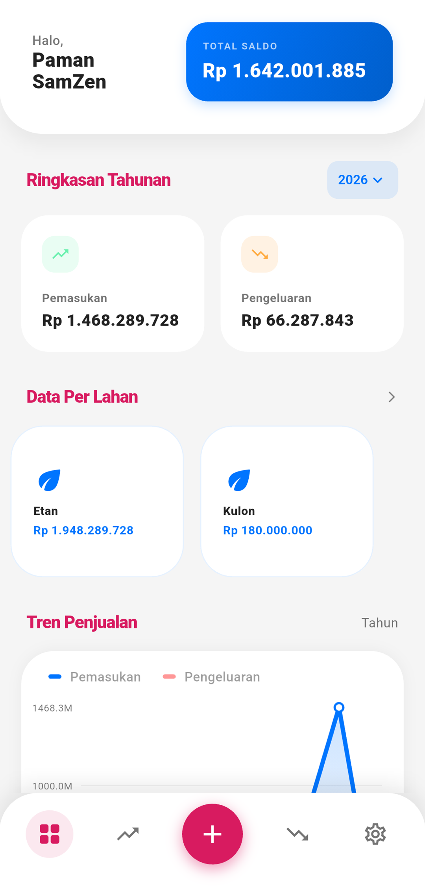
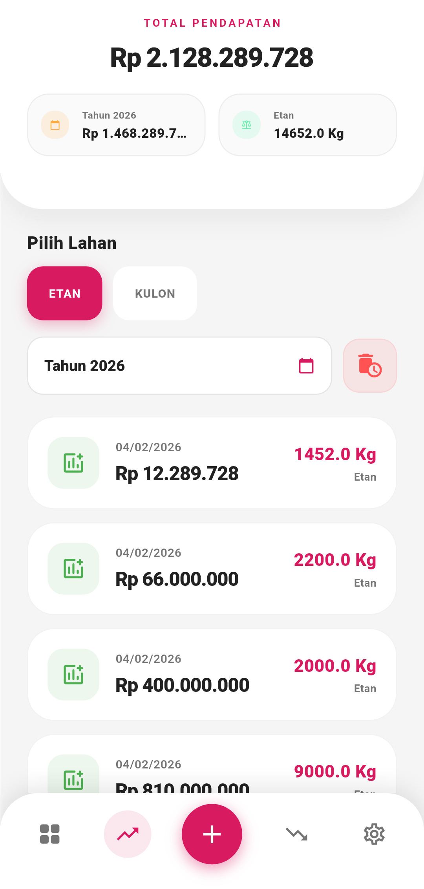
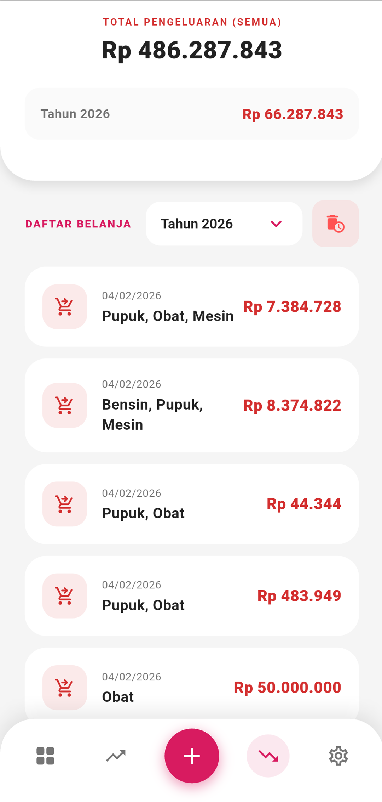
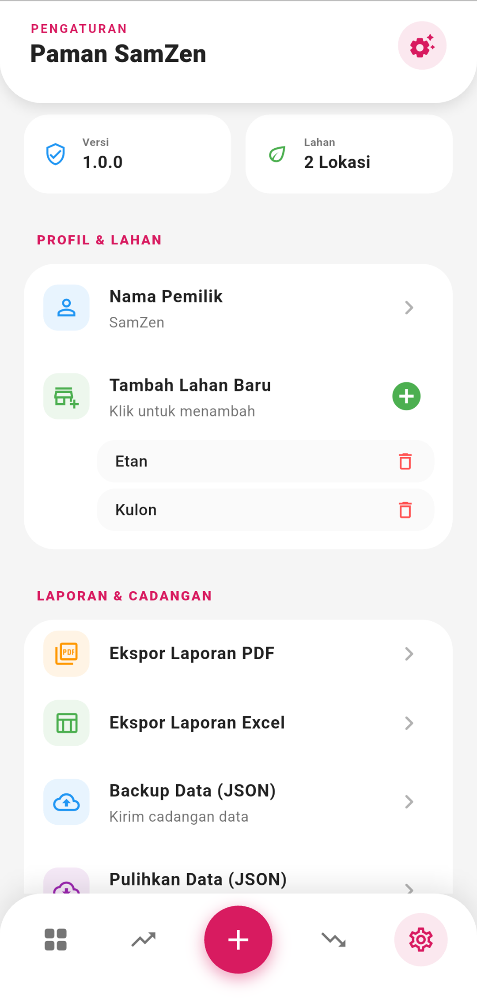
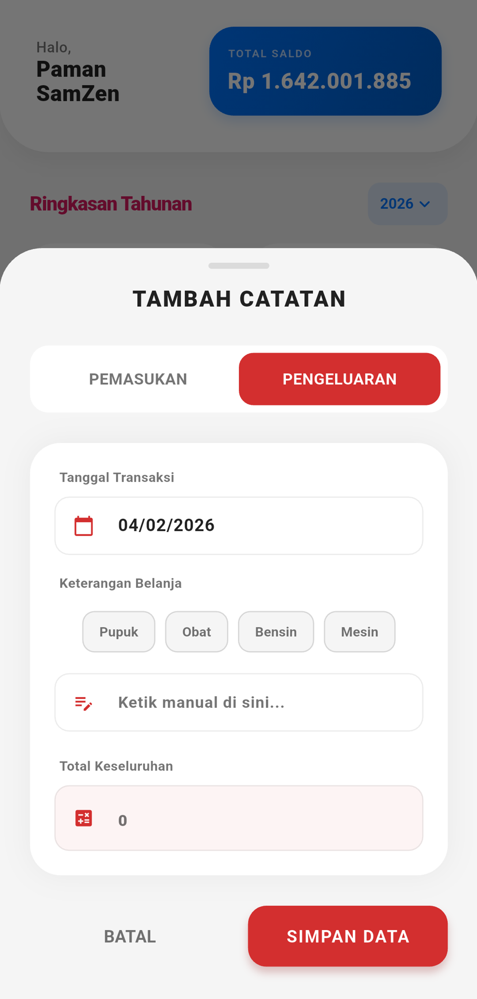
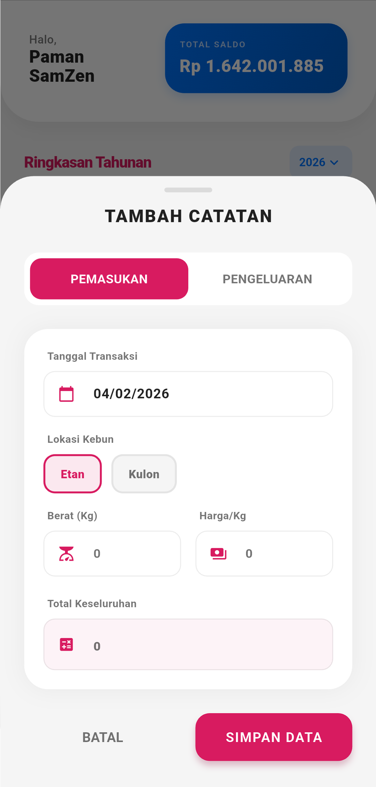

# 🍃 KebunKas - Pengelola Keuangan Pribadi
<div align="center">

[](https://flutter.dev)
[](https://www.sqlite.org/)
[](https://github.com/DonatGula/Kebunkas-app/releases)

</div>

**KebunKas** adalah aplikasi pengelolaan keuangan pribadi yang dirancang untuk memudahkan Anda memantau aliran kas (pemasukan & pengeluaran) dengan antarmuka yang segar, modern, dan intuitif.

---
<div align="center">
 |  | 
 |  | 
</div>

## ✨ Fitur Utama

* **📈 Analisis Visual**: Pantau tren keuangan Anda secara real-time melalui grafik garis (*Line Chart*) yang interaktif.
* **📄 Laporan PDF**: Ekspor laporan keuangan bulanan ke dalam format PDF yang rapi dan siap cetak.
* **📊 Ekspor Excel**: Simpan data transaksi ke format `.xlsx` untuk keperluan pencadangan atau analisis data lebih lanjut.
* **💾 Penyimpanan Lokal**: Privasi terjamin dengan database SQLite. Data tersimpan sepenuhnya di perangkat Anda tanpa perlu login akun.
* **🌓 Mode Gelap & Terang**: Mendukung preferensi visual pengguna untuk kenyamanan mata di berbagai kondisi cahaya.

## 🛠️ Teknologi yang Digunakan

Aplikasi ini dibangun menggunakan ekosistem Flutter terbaru:

* **[Flutter](https://flutter.dev)** - Framework UI lintas platform.
* **[sqflite](https://pub.dev/packages/sqflite)** - Solusi database lokal yang andal.
* **[fl_chart](https://pub.dev/packages/fl_chart)** - Library powerful untuk visualisasi grafik.
* **[Provider](https://pub.dev/packages/provider)** - State management yang efisien dan bersih.

## 🚀 Cara Instalasi

Ikuti langkah-langkah berikut untuk menjalankan proyek ini secara lokal:

1.  **Prasyarat**: Pastikan Anda sudah menginstal [Flutter SDK](https://docs.flutter.dev/get-started/install).
2.  **Clone Repositori**:
    ```bash
    git clone [https://github.com/DonatGula/Kebunkas-app.git](https://github.com/DonatGula/Kebunkas-app.git)
    ```
3.  **Penyesuaian Folder**:
    > [!IMPORTANT]
    > Silakan ubah nama folder tersebut menjadi `appjeruk` agar sesuai dengan konfigurasi package.
4.  **Instal Dependensi**:
    Masuk ke folder proyek dan jalankan:
    ```bash
    flutter pub get
    ```
5.  **Jalankan Aplikasi**:
    ```bash
    flutter run
    ```

---

## 📄 Lisensi

Proyek ini 100% free untuk pribadi/belajar, di larang keras untuk di jual belikan. Lihat berkas [LICENSE](LICENSE) untuk informasi lebih lanjut.

---
**KebunKas** - *Kelola uangmu seperti merawat kebun.* 🌿
🚀 **Natgul - 2026** 
